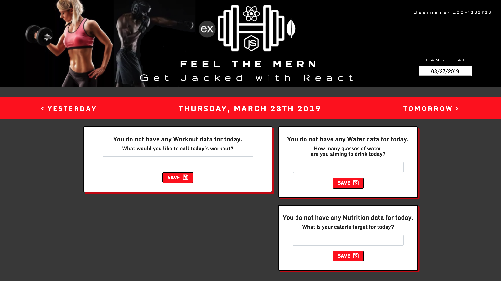
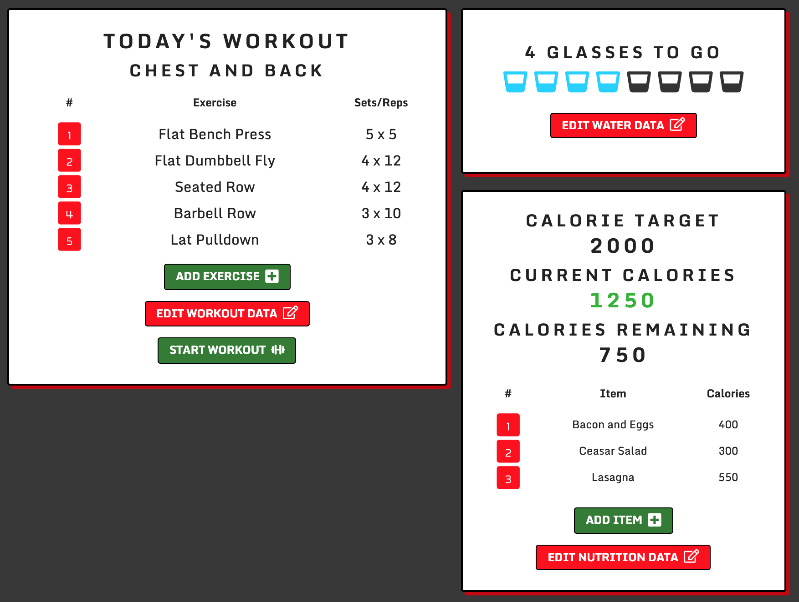
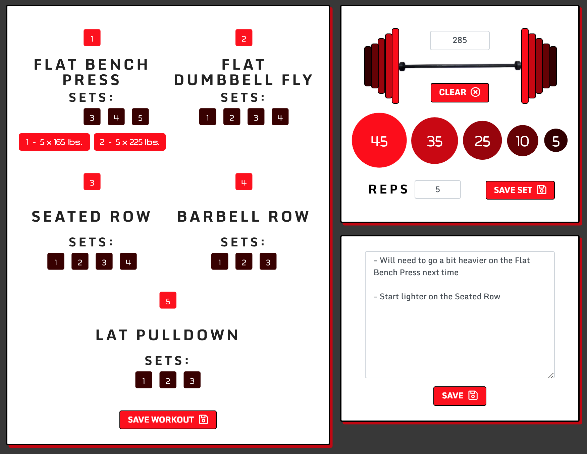

# FEEL THE MERN - *Get Jacked with React!*

[Link to the App](https://lii41333733.github.io/rate-my-plate/)

## Introduction

Summer is around the corner and the time to buckle down on fitness goals is now! Achieve the body you've always dreamed of with the help of *Feel the MERN - Get Jacked with React!* Focused on your workout, nutrition and hydration goals, *Feel the MERN* provides you an easy and user-friendly way to log your data so you can consistently hit the benchmarks that you set for yourself, day in and day out. In the *Workout Mode*, you can quickly total the weight you have on the bar simply by clicking on the designated plates so you're in, out and back to your workout just in time for your next set!

Each day contains a set of workout, nutrition and hydration goals you set:
* For workouts, you set the name of the workout and include all workouts to be done on that day. When you are done setting your lineup, the *Workout Mode* will bring you to where you can record the amount of reps completed for each set. Additionally you can leave notes for the workout to review later. 
* For your nutrition goals, you set the amount of calories you would like to maintain for the day. As you enter in items, the calculator will total the calories you set for each item and subtract from your overall goal. 
* For hydration goals, each day you set how many glasses of water you would like to consume and with just a click, you can record each glass drank.

## Proof of Concept

This was my first major project using React showcasing core React fundamentals, my introduction to JSX and using *State*. At first, mixing JavaScript with HTML was a tough nut to crack, but eventually it began to make sense. The most interesting thing about React to me were *Components* and how they are built to be re-usable so repeating code is obsolete. I look forward to taking on more React projects and learning more about of the new tools released for it like the newly released *Hooks*.

## Technologies Used

* Bootstrap
* MongoDB
* Express
* React
* Node.js / NPM

## Screenshots

### Day Start

### Full Dashboard

### Workout Mode

## Prospective Improvememts

* Tracking Macros
* Authentication and login
* Fixing CSS without having to adjust browser zoom

## NOTE

About 75% through completion is when I realized that my browser zoom was not set to 100% and thus all the CSS is skewed to that incorrect setting, so please adjust your browser zoom to around 80% which would be optimal for use on this app. Will optomize the settings in the near future.
